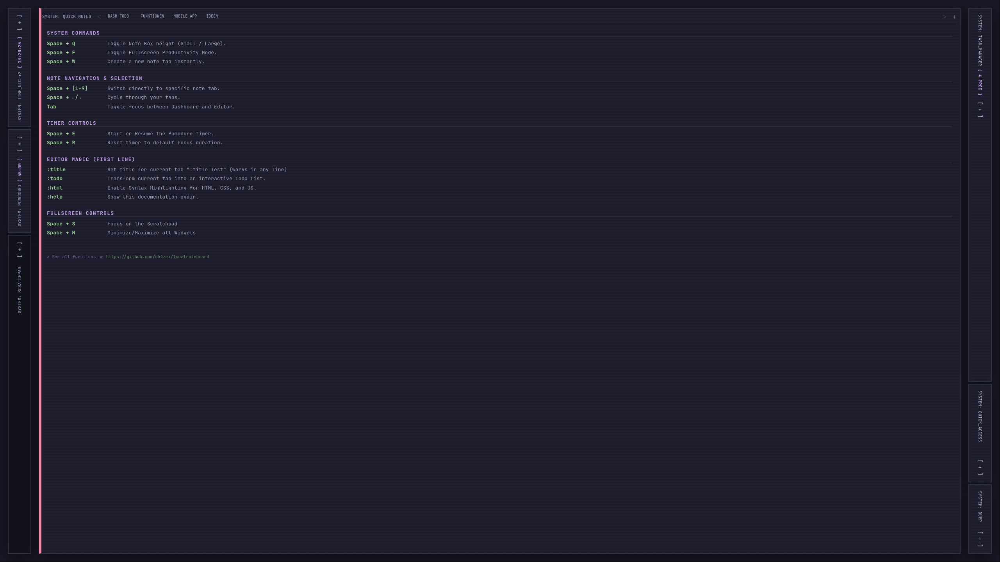
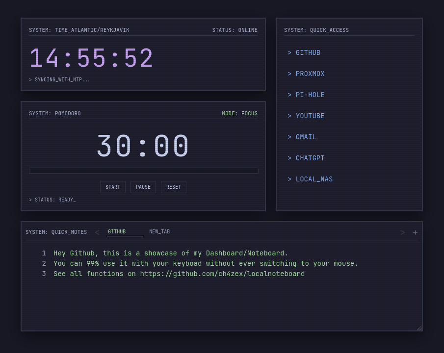
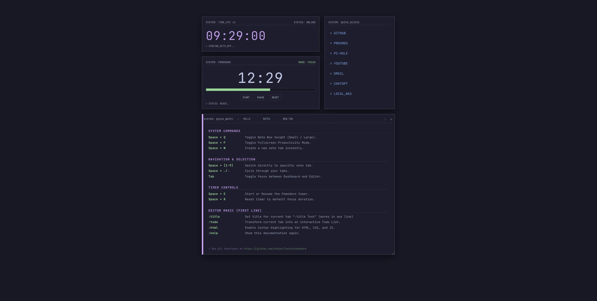
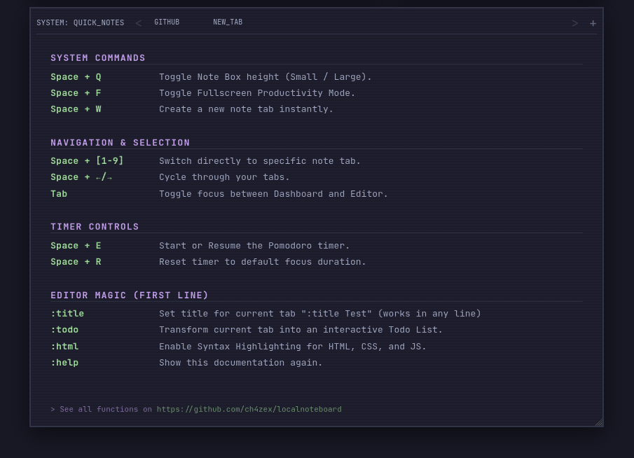
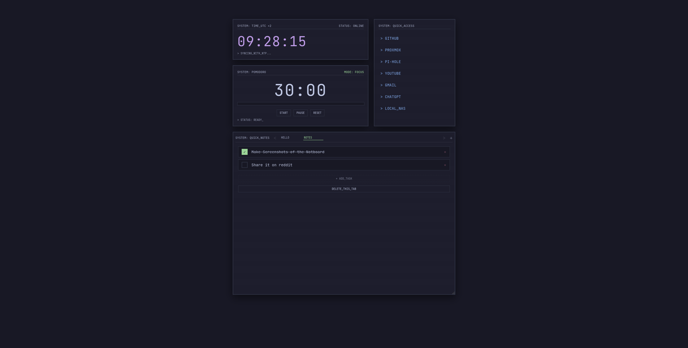
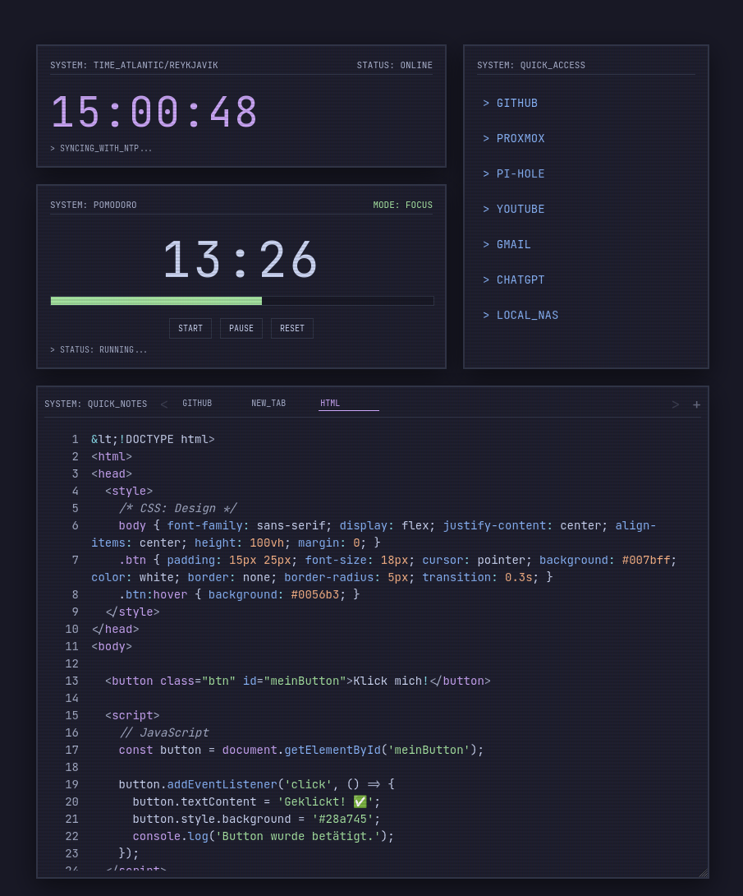
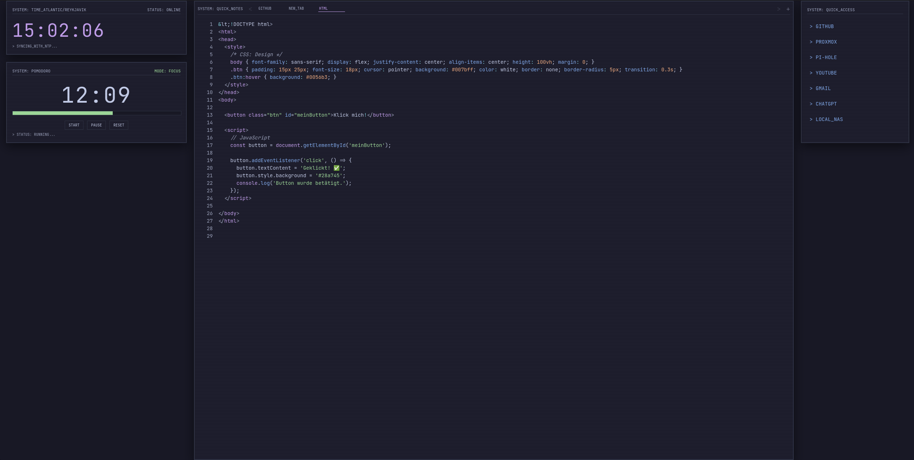

# Local Note Dashboard

Hello everyone! Today I'm sharing my personal note dashboard with you. I created it for myself, but I believe some of you might find it useful.



<a href="https://ch4ze.ct.ws/">DEMO</a>

## Features

This dashboard is designed to be a highly customizable and efficient personal workspace, running entirely in your browser using Local Storage for data persistence.

*   **Sleek Catppuccin Mocha Theme:** A visually pleasing and comfortable color scheme for extended use.
*   **Responsive & Scalable Layout:** The dashboard dynamically adjusts to your window size, and a fullscreen mode is available for focused work.
    *   **Screenshot:** Main dashboard view, showing all widgets.
*   **Dynamic Decipher Effects:** Interactive text effects on headers for a retro-futuristic feel.
*   **Customizable Clock:**
    *   Displays current time with seconds.
    *   Supports various IANA timezones (e.g., `Europe/Berlin`) and UTC offsets (e.g., `UTC+2`).
    *   **Screenshot:** Clock widget with timezone input visible.
*   **Editable Quicklinks:**
    *   Manage a list of frequently visited URLs directly from the dashboard.
    *   Easy edit mode to add, modify, or remove links.
*   **Integrated Pomodoro Timer:**
    *   Configurable focus and break durations.
    *   Start, pause, and reset functionalities.
    *   Visual progress bar with seek capability.
    *   Audible beep on session completion.
    *   **Screenshot:** Pomodoro timer in focus mode, progress bar partially filled.
*   **Advanced Quick Notes System:**
    *   **Multiple Tabs:** Organize your thoughts across various note tabs.
    *   **Tab Naming:** Rename tabs directly by clicking on their name.
    *   **Tab Navigation:** Scroll through tabs with dedicated buttons or keyboard shortcuts.
    *   **Dynamic Resizing:** The notes area automatically adjusts its height as you type.
    *   **Line Numbers:** Provides line numbers for better code or text navigation.
    *   **Screenshot:** Notes widget with multiple tabs, one active.
*   **Powerful Note Commands (Type in any line, press Enter):**
    *   `:title [Your New Title]` - Changes the name of the current tab. (e.g., `:title Shopping List`)
        *   **Screenshot:** Notes area with `:title` command typed, then a screenshot of the tab name updated.
    *   `:todo` - Transforms the current tab into an interactive Todo List.
        *   **Screenshot:** Notes tab converted to a todo list with a few items.
    *   `:html` - Activates syntax highlighting for HTML, CSS, and JavaScript code within the tab.
        *   **Screenshot:** Notes tab with `:html` mode active, showing some highlighted code.
    *   `:help` - Displays a comprehensive list of all available commands and keyboard shortcuts.
        *   **Screenshot:** The help view.
*   **Intuitive Keyboard Shortcuts:**
    *   `Space + Q`: Toggle notes box height (small/large).
    *   `Space + F`: Toggle fullscreen productivity mode.
    *   `Space + W`: Create a new note tab.
    *   `Space + [1-9]`: Switch directly to a specific note tab.
    *   `Space + ←/→`: Cycle through note tabs.
    *   `Tab`: Toggle focus between dashboard elements and the notes editor.
    *   `Space + E`: Start/Resume Pomodoro timer.
    *   `Space + R`: Reset Pomodoro timer.
*   **Local Storage Persistence:** All your settings, links, and notes are automatically saved in your browser's local storage, ensuring your data is retained even after closing the browser.

## Installation

This dashboard is a single HTML file, making installation incredibly simple!

1.  **Download the file:**
    *   Download `localnoteboard.html` from this repository.
2.  **Open in your browser:**
    *   Simply open the `localnoteboard.html` file with your preferred web browser (e.g., Chrome, Firefox, Edge).

That's it! Your dashboard will load, and all your data will be saved locally in your browser.

## Usage

*   **Getting Started:** Upon first load, the `:help` view will be displayed. Press `Space + W` or select an existing tab to start typing.
*   **Customizing:** Explore the various commands (`:title`, `:todo`, `:html`) and keyboard shortcuts to tailor the dashboard to your workflow.
*   **Data Persistence:** Your data is automatically saved. There's no "save" button needed.

## Screenshots

Here are some screenshots to give you an idea of the dashboard's appearance and functionality:
<div align="center">
    
    
    
    
    
    
  </a> 

## Contributing

Feel free to fork this repository, suggest improvements, or report issues!

## License

This project is open-source and available under the MIT License.
```
